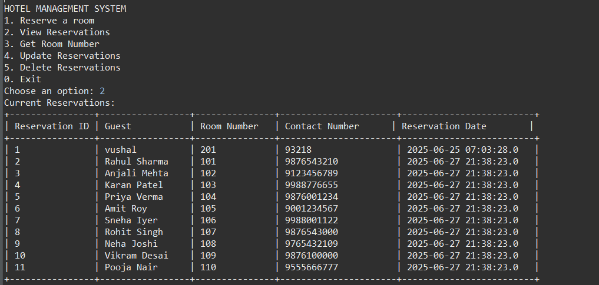

<!-- ──────────────────────────────────────────────────────────────── -->
<!--  Hotel Reservation System – README                              -->
<!-- ──────────────────────────────────────────────────────────────── -->

<h1 align="center">🏨 Hotel Reservation System</h1>

  A  Very Basic & simple <strong>Java + MySQL CLI application</strong> that demonstrates CRUD
  operations (Create, Read, Update, Delete) on hotel room reservations using
  <code>JDBC</code>. Perfect as a learning project for JDBC, SQL, and basic
  object-oriented programming.

  
  

---

## ✨ Features

| Command-line Option      | What it does                                              |
| ------------------------ | --------------------------------------------------------- |
| **1 Reserve a room**     | Add a new reservation with guest name, room no., contact  |
| **2 View reservations**  | List all current reservations in a nicely formatted table |
| **3 Get room number**    | Retrieve room number by Reservation ID + guest name       |
| **4 Update reservation** | Change guest name, room no., or contact details           |
| **5 Delete reservation** | Remove a reservation by ID                                |
| **0 Exit**               | Graceful exit with a fun countdown                        |

---

## 🏗️ Tech Stack

| Layer     | Tech                                                 |
| --------- | ---------------------------------------------------- |
| Language  | Java 17 (or newer)                                   |
| Database  | MySQL 8.x (works with older versions too)            |
| Driver    | MySQL Connector/J 8.x                                |
| Build/Run | Any IDE (IntelliJ / VS Code) or plain `javac + java` |

---

## 📸 Screenshots

| Dashboard                              |
| -------------------------------------- |
|  |

This is DashBoard Page. You Can refer more Operations 
